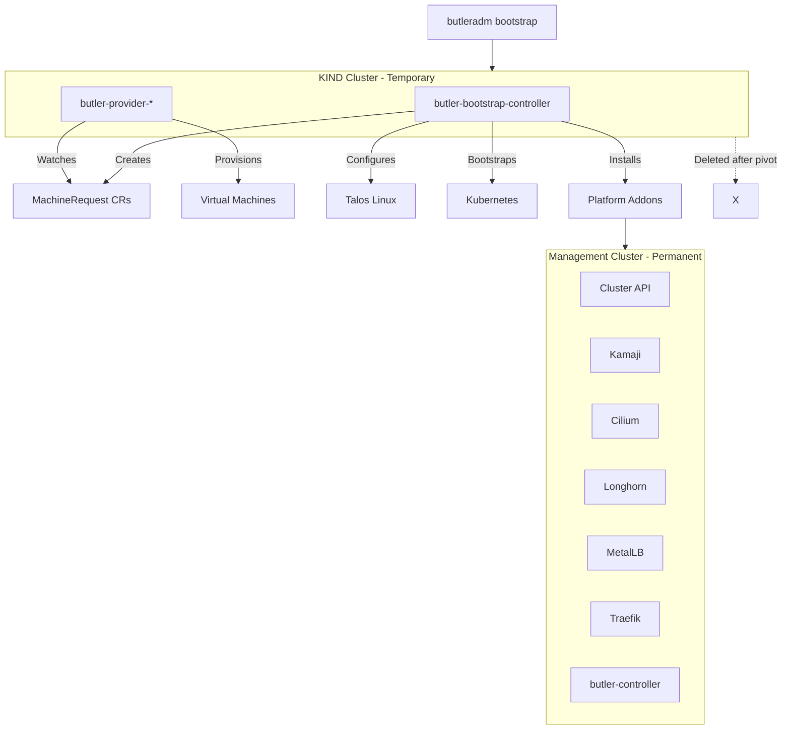

# butler-bootstrap

Bootstrap controller for provisioning Butler management clusters.

## Table of Contents

- [Overview](#overview)
- [Architecture](#architecture)
- [Supported Infrastructure](#supported-infrastructure)
- [How It Works](#how-it-works)
- [Bootstrap Phases](#bootstrap-phases)
- [Development](#development)
- [Contributing](#contributing)
- [License](#license)

## Overview

butler-bootstrap is an internal controller used by the Butler platform to orchestrate management cluster creation. It handles VM provisioning, Talos Linux configuration, Kubernetes bootstrapping, and platform addon installation.

**You do not need to install or run butler-bootstrap directly.** It is packaged within the `butleradm` CLI and runs automatically when you execute:

```sh
butleradm bootstrap <provider> --config bootstrap.yaml
```

The CLI handles everything: spinning up a temporary KIND cluster, deploying the bootstrap controller, monitoring progress, and cleaning up when complete.

## Architecture



### Component Responsibilities

| Component | Responsibility |
|-----------|----------------|
| butleradm CLI | User interface, orchestrates the bootstrap process |
| butler-bootstrap | Controller that manages bootstrap phases and addon installation |
| butler-provider-* | Provider-specific controllers for VM provisioning |

## Supported Infrastructure

Butler supports management cluster deployment across on-premises hyperconverged infrastructure and public cloud platforms.

### On-Premises

| Provider | Status |
|----------|--------|
| Harvester HCI | Supported |
| Nutanix AHV | Planned |
| Proxmox VE | Planned |

### Public Cloud

| Provider | Status |
|----------|--------|
| AWS | Planned |
| Azure | Planned |
| Google Cloud | Planned |

Provider support is implemented through separate butler-provider-* controllers that handle infrastructure-specific VM provisioning. The bootstrap controller itself is provider-agnostic.

## How It Works

When you run `butleradm bootstrap`, the following happens automatically:

1. The CLI creates a temporary KIND cluster on your local machine
2. butler-bootstrap and the appropriate provider controller are deployed to KIND
3. The bootstrap controller creates MachineRequest CRs for each node
4. The provider controller provisions VMs on your target infrastructure
5. Talos Linux is configured and applied to each VM
6. The first control plane node is bootstrapped
7. Platform addons are installed in dependency order
8. The kubeconfig and talosconfig are saved locally
9. The KIND cluster is deleted

The resulting management cluster is fully self-sufficient. You interact with it using standard Kubernetes tools (kubectl) and the `butlerctl` CLI for tenant cluster operations.

## Bootstrap Phases

| Phase | Description |
|-------|-------------|
| Pending | Validating configuration and provider connectivity |
| ProvisioningMachines | Creating VMs via MachineRequest CRs |
| ConfiguringTalos | Generating and applying Talos machine configs |
| BootstrappingCluster | Running talosctl bootstrap, retrieving kubeconfig |
| InstallingAddons | Installing platform components in dependency order |
| Pivoting | Finalizing cluster handoff |
| Ready | Bootstrap complete |

### Addon Installation Order

The controller installs addons in a specific order to satisfy dependencies:

1. kube-vip (control plane VIP)
2. Cilium (CNI with kube-proxy replacement)
3. cert-manager (TLS certificates)
4. Longhorn (distributed storage)
5. MetalLB (LoadBalancer services)
6. Traefik (ingress controller)
7. Kamaji (hosted control planes)
8. Cluster API (cluster lifecycle management)
9. Flux (GitOps, optional)
10. butler-controller (tenant cluster management)

## Development

This section is for contributors working on butler-bootstrap itself.

### Prerequisites

- Go 1.24+
- Docker
- kubectl
- make

### Building

```sh
make build
```

### Running Locally

For testing controller logic outside of the full bootstrap flow:

```sh
make run
```

### Running Tests

```sh
make test
```

### Building the Container Image

```sh
make docker-build IMG=ghcr.io/butlerdotdev/butler-bootstrap:dev
```

### Project Structure

```
butler-bootstrap/
├── cmd/
│   └── main.go                 # Controller entrypoint
├── internal/
│   ├── controller/
│   │   └── clusterbootstrap_controller.go
│   ├── addons/
│   │   └── installer.go        # Addon installation logic
│   └── talos/
│       └── client.go           # Talos CLI wrapper
├── config/
│   ├── default/                # Kustomize base
│   ├── manager/                # Controller deployment
│   └── rbac/                   # RBAC configuration
├── Dockerfile
├── Makefile
└── README.md
```

## Contributing

Contributions are welcome. Please read the [contributing guidelines](https://github.com/butlerdotdev/butler/blob/main/CONTRIBUTING.md) before submitting a pull request.

### Running Lints

```sh
make lint
```

### Running All Checks

```sh
make test
make lint
```

## License

Copyright 2026 The Butler Authors.

Licensed under the Apache License, Version 2.0 (the "License");
you may not use this file except in compliance with the License.
You may obtain a copy of the License at

    http://www.apache.org/licenses/LICENSE-2.0

Unless required by applicable law or agreed to in writing, software
distributed under the License is distributed on an "AS IS" BASIS,
WITHOUT WARRANTIES OR CONDITIONS OF ANY KIND, either express or implied.
See the License for the specific language governing permissions and
limitations under the License.
